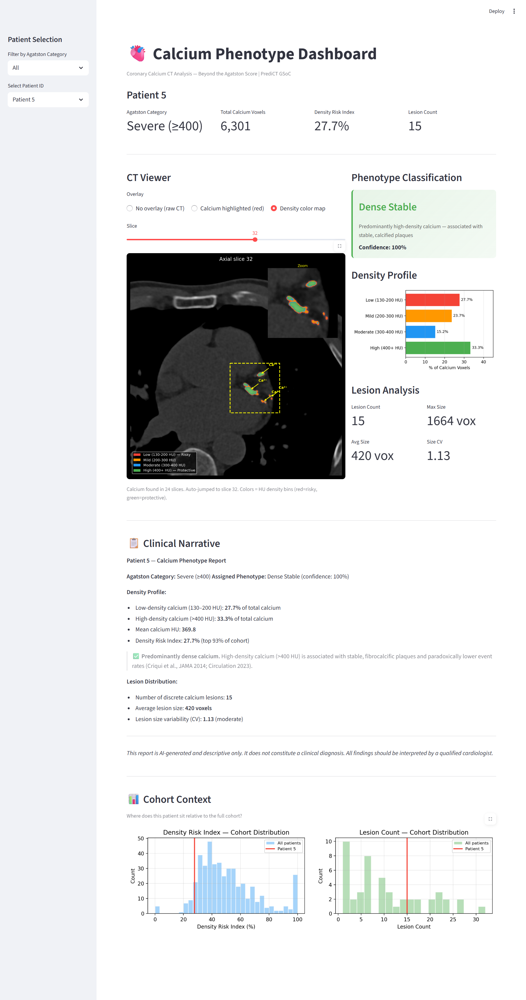

# PrediCT GSoC — COCA Dataset Pipeline & Radiomics Analysis

This repository contains my evaluation tasks for the **PrediCT Google Summer of Code project**
at Stanford AIMI. It includes a full preprocessing pipeline for the COCA cardiac CT dataset,
a radiomics feature extraction and statistical analysis pipeline, and an interactive clinical
dashboard for calcium phenotype visualization.

---

## Repository Structure

```
prediCT-gsoc/
├── common_task/                   # Common Task: COCA Dataset Preprocessing
│   ├── COCA_pipeline.py           # Main runner — orchestrates all steps
│   ├── COCA_processor.py          # DICOM → NIfTI image + segmentation mask
│   ├── COCA_resampler.py          # Resamples to target voxel spacing
│   ├── unnester.py                # Flattens nested DICOM folder structure
│   ├── splits.py                  # Stratified train/val/test split
│   ├── dataloader.py              # PyTorch data loader with augmentation
│   ├── dataset_statistics.py      # Generates dataset statistics report
│   └── justification.md           # Written justification + dataset statistics
│
├── project2_radiomics/            # Specific Task: Project 2 (Radiomics & Phenotyping)
│   ├── extract_features.py        # PyRadiomics feature extraction + Agatston scores
│   ├── statistical_analysis.py    # Spearman, Kruskal-Wallis, visualizations
│   ├── unsupervised_analysis.py   # K-Means clustering, UMAP, phenotype characterization
│   ├── density_fingerprint.py     # Calcium density fingerprinting (HU distribution)
│   ├── per_lesion_features.py     # Per-lesion feature extraction + aggregation
│   ├── dashboard.py               # Interactive Streamlit clinical dashboard
│   └── results/
│       ├── features.csv                      # Radiomic features (23 patients)
│       ├── density_features.csv              # Density fingerprints (447 patients)
│       ├── per_lesion_features.csv           # Per-lesion features (48 patients)
│       ├── spearman_results.csv              # Spearman correlation results
│       ├── kruskal_results.csv               # Kruskal-Wallis test results
│       ├── cluster_assignments.csv           # GMM cluster assignments
│       ├── correlation_matrix.png
│       ├── significant_features.png
│       ├── agatston_distribution.png
│       ├── tsne.png
│       ├── umap.png
│       ├── cluster_selection.png
│       ├── phenotype_profiles.png
│       ├── cluster_agatston_distribution.png
│       ├── density_fingerprints.png
│       ├── density_contrast.png
│       └── per_lesion_analysis.png
│
└── README.md
```

---

## Dataset

**COCA — Coronary Calcium and Chest CTs** (Stanford AIMI)
- 787 patients, ECG-gated cardiac CT scans
- Plist XML segmentation masks annotating coronary calcium deposits
- Downloaded via AzCopy from Stanford AIMI Azure storage

> Dataset requires individual registration at https://stanfordaimi.azurewebsites.net/

---

## Common Task: COCA Dataset Preprocessing

### Goal
Build a preprocessing and data loading pipeline tailored to Project 2 (Radiomics).

### Setup

```bash
conda create -n gsoc python=3.9
conda activate gsoc
pip install numpy pandas SimpleITK opencv-python tqdm scikit-learn torch openpyxl
```

### Usage

```bash
cd common_task
python COCA_pipeline.py
```

The pipeline runs interactively through 3 steps:

**Step 1 — Unnesting:** Flattens variable-named scanner subfolders so DICOM slices sit directly inside each patient folder.

**Step 2 — Processing (DICOM → NIfTI):** Loads each patient's DICOM series as a 3D volume, parses the XML calcium segmentation mask, and saves both as `.nii.gz` files.

**Step 3 — Resampling:** Resamples all volumes to uniform spacing of **0.7 × 0.7 × 3.0 mm**.

### Results

```
787 patients processed
40,113 DICOM files → 787 image.nii.gz + 787 seg.nii.gz
449 patients with XML calcium annotations
447 patients with non-zero calcium voxels
```

### Dataset Statistics

| Category | Voxel Range | Count | Percentage |
|----------|-------------|-------|------------|
| None | 0 | 340 | 43.2% |
| Mild | 1–500 | 258 | 32.8% |
| Moderate | 501–2000 | 114 | 14.5% |
| Severe | >2000 | 75 | 9.5% |
| **Total** | | **787** | **100%** |

### Stratified Split (70/15/15)

| Category | Train (550) | Val (118) | Test (119) |
|----------|-------------|-----------|------------|
| None | 238 (43.3%) | 51 (43.2%) | 51 (42.9%) |
| Mild | 180 (32.7%) | 39 (33.1%) | 39 (32.8%) |
| Moderate | 80 (14.5%) | 17 (14.4%) | 17 (14.3%) |
| Severe | 52 (9.5%) | 11 (9.3%) | 12 (10.1%) |

### Data Loader

```python
from splits import make_splits
from dataloader import make_dataloaders

train_df, val_df, test_df = make_splits("processed/tables/scan_index.csv")
train_loader, val_loader, test_loader = make_dataloaders(
    train_df, val_df, test_df,
    resampled_root="processed/data_resampled"
)
# Each batch: image [2,1,80,512,512], mask [2,1,80,512,512], label [2]
```

**Design choices for radiomics compatibility:**
- HU windowing [−200, 1000] — captures calcium range while excluding noise
- Augmentation: flip + intensity shift ±2% only — elastic deformation excluded to preserve texture features
- WeightedRandomSampler corrects 43% none-class imbalance

---

## Specific Task: Project 2 (Radiomics & Phenotyping) - Feature Extraction

### Setup

```bash
conda activate gsoc
pip install pyradiomics scipy scikit-learn matplotlib seaborn umap-learn streamlit plotly
pip install "numpy<2"
```

### Step 1 — PyRadiomics Feature Extraction

```bash
python project2_radiomics/extract_features.py
```

Extracts 18 radiomic features from 23 patients (Shape, GLCM, GLSZM, GLRLM) + Agatston scores.

### Step 2 — Statistical Analysis

```bash
python project2_radiomics/statistical_analysis.py
```

**Results: 11/18 features statistically significant (p < 0.05)**

| Feature | Spearman ρ | p-value |
|---------|-----------|---------|
| glszm_GrayLevelNonUniformity | +0.966 | <0.0001 |
| glrlm_RunLengthNonUniformity | +0.960 | <0.0001 |
| shape_MeshVolume | +0.933 | <0.0001 |
| shape_VoxelVolume | +0.933 | <0.0001 |
| glcm_JointEnergy | −0.911 | <0.0001 |
| shape_Sphericity | −0.884 | <0.0001 |

### Step 3 — Unsupervised Clustering & Phenotyping

```bash
python project2_radiomics/unsupervised_analysis.py
```

K-Means (k=4) + UMAP discovered 4 calcium phenotypes. Key finding: patients with the
same Agatston category have fundamentally different morphological profiles.

| Cluster | Patients | Avg Agatston | Phenotype |
|---------|----------|-------------|-----------|
| 1 | 7 | 67.8 | Small & Compact — focal round nodules |
| 2 | 5 | 3005.3 | Large & Heterogeneous — dense complex plaques |
| 3 | 1 | 0.0 | Homogeneous — no significant calcium |
| 4 | 10 | 681.1 | Mixed — moderate volume, irregular texture |

### Step 4 — Calcium Density Fingerprinting *(Novel)*

```bash
python project2_radiomics/density_fingerprint.py
```

Runs on all **447 patients** with calcium. Classifies each patient's calcium into 4 HU
density bins based on Criqui et al. (JAMA 2014):

| HU Range | Type | Clinical Meaning |
|----------|------|-----------------|
| 130–200 | Low-density | Spotty, vulnerable — associated with plaque rupture |
| 200–300 | Mild-density | Intermediate |
| 300–400 | Moderate-density | More stable |
| 400+ | High-density | Dense, paradoxically **protective** |

**Key finding:** Mild Agatston patients have the highest proportion of low-density
(risky) calcium — 58.2% vs 35.7% for Severe. The Agatston score alone misses this.

```
Mild:     58.2% low-density,  5.5% high-density
Moderate: 42.4% low-density, 13.6% high-density
Severe:   35.7% low-density, 19.8% high-density  ← paradoxically more stable
```

### Step 5 — Per-Lesion Feature Extraction *(Novel)*

```bash
python project2_radiomics/per_lesion_features.py --n_patients 50
```

Instead of one feature vector per patient, extracts features for each individual calcium
lesion separately (via connected component analysis), then aggregates with 6 statistics
(mean, max, min, std, skewness, kurtosis) → **432 features per patient**.

**Key finding:**

| Category | Avg Lesion Count | Avg Size | Size Variability |
|----------|-----------------|----------|-----------------|
| Mild | 3.1 | 90 voxels | 0.50 (uniform) |
| Moderate | 9.1 | 133 voxels | 1.27 |
| Severe | 19.6 | 237 voxels | 1.73 (highly variable) |

Severe patients have 6× more lesions than mild — information invisible to the Agatston score.

### Step 6 — Interactive Clinical Dashboard

```bash
streamlit run project2_radiomics/dashboard.py
```

Opens at `http://localhost:8501`.



**The dashboard provides a complete per-patient calcium phenotype report:**

- **CT Viewer** — Axial CT slice with auto-jump to the most calcium-dense slice. Three overlay modes: raw CT (no overlay), calcium highlighted in red, and density color map where each calcium voxel is colored by its HU value (red = low-density/risky, green = high-density/protective). A zoom inset in the top-right corner magnifies the calcium region, with Ca²⁺ arrows pointing to each individual deposit.

- **Phenotype Classification** — GMM-based phenotype assignment (Vulnerable Spotty / Dense Stable / Mixed Pattern) with confidence score. Color-coded card for immediate visual interpretation.

- **Density Profile** — Horizontal bar chart showing the percentage of calcium voxels in each HU bin. Directly visualizes the density paradox: a patient with Agatston 50 but 90% red bars is more dangerous than a Severe patient with 40% green bars.

- **Lesion Analysis** — Lesion count, average size, max size, and size coefficient of variation. High lesion count = diffuse multi-vessel disease; high CV = one dominant large lesion plus many small ones.

- **Clinical Narrative** — Auto-generated plain-English summary citing primary literature (Criqui et al. JAMA 2014, Hoori et al. Scientific Reports 2024). Includes explicit disclaimer that findings are AI-generated and require clinical review.

- **Cohort Context** — Histograms showing where the selected patient sits relative to all 447 patients in the dataset for Density Risk Index and Lesion Count.

> **Note:** The dashboard requires the processed NIfTI files and pre-computed CSVs from the pipeline. It runs locally on your machine. A full demo screenshot is shown above.

---

## Key Findings & Hypothesis

The central finding of this work is that **the Agatston score alone is insufficient
to characterize calcium risk**. Three lines of evidence support this:

1. **Density paradox:** Mild patients have 58% low-density (vulnerable) calcium vs
   36% for Severe — a patient with a low score can have a more dangerous calcium profile
   than a patient with a high score (Criqui et al., JAMA 2014)

2. **Morphological diversity:** Unsupervised clustering reveals distinct phenotypes
   within the same Agatston category. Cluster 2 (avg score 3005) and Cluster 4
   (avg score 681) are both "Severe" but have completely different morphologies

3. **Lesion patterns:** Per-lesion analysis shows Severe patients have 6× more discrete
   lesions — diffuse multi-vessel disease vs focal single-vessel disease, both scoring
   identically under the Agatston system

This supports **radiomic phenotyping as a complement to Agatston scoring** in cardiac
risk stratification — the core goal of PrediCT Project 2.

---

## Requirements

```
numpy<2
pandas
SimpleITK
opencv-python
tqdm
scikit-learn
torch
scipy
matplotlib
seaborn
pyradiomics
openpyxl
umap-learn
streamlit
plotly
```

---

## Author

**HoangLongCan**
GSoC 2025 applicant — PrediCT (Stanford AIMI)
