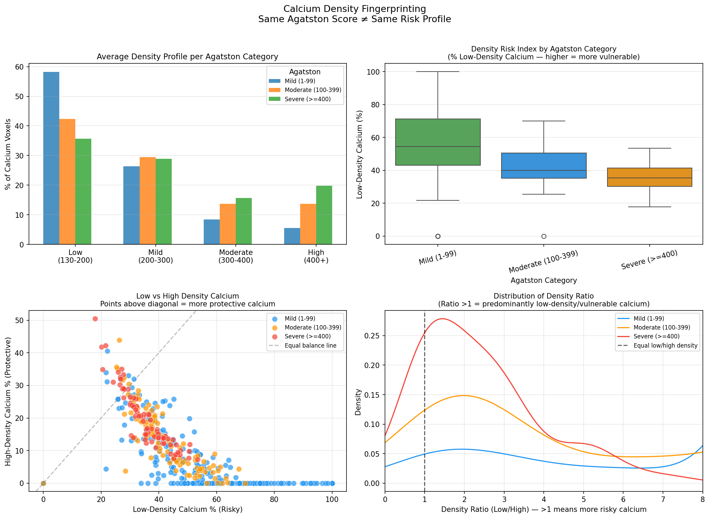
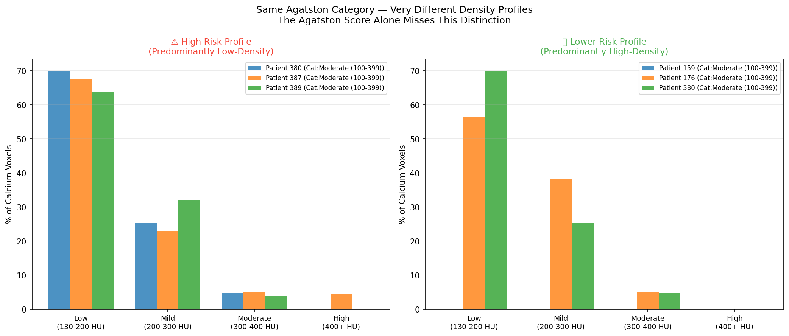
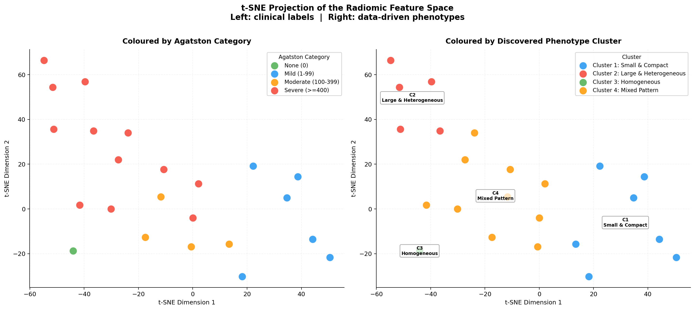
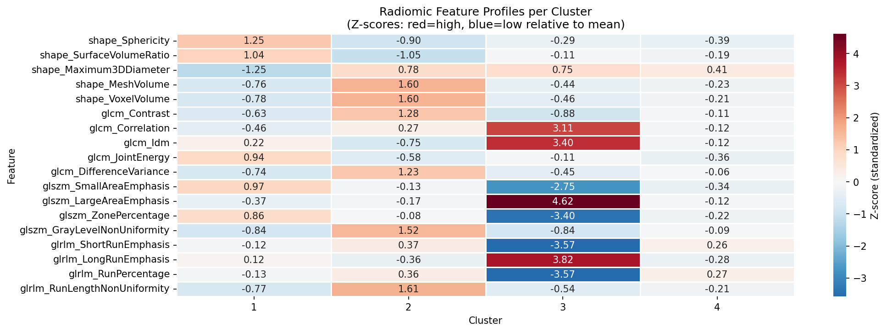
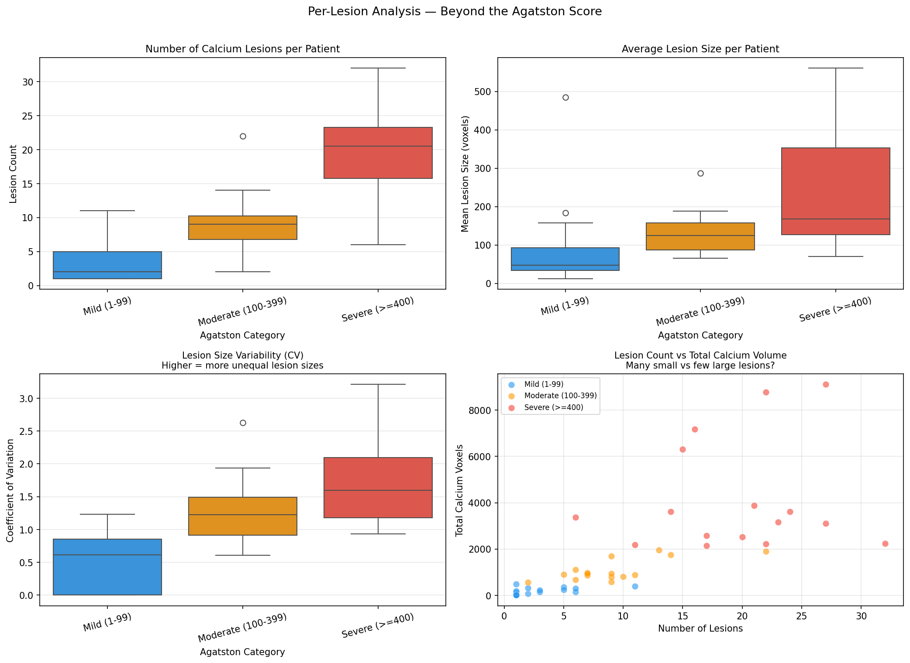

# Beyond the Agatston Score: A Radiomic Phenotyping Framework for Coronary Calcium Morphology Discovery and Validation

**GSoC 2025 Proposal — PrediCT / ML4SCI / Stanford AIMI**

**Applicant:** Long Huynh
**University:** The University of Alabama (Undergraduate)
**GitHub:** https://github.com/HoangLongCanCode/prediCT-gsoc
**Project Duration:** 175 hours

---

## Abstract

The Agatston score has guided coronary artery calcium (CAC) risk stratification for over three decades, yet it reduces the full 3D complexity of calcium morphology to a single integer. A growing body of evidence demonstrates that calcium **density**, **lesion count**, and **spatial distribution** provide independent prognostic information beyond total calcium burden — but these dimensions are invisible to the Agatston score.

This proposal addresses four interconnected research questions using the COCA gated dataset (787 patients, Stanford AIMI):

1. Does calcium density stratification reveal clinically meaningful risk differences within the same Agatston category?
2. Do radiomic features discover natural calcium phenotypes that cut across Agatston boundaries?
3. Does per-lesion feature extraction, aggregated across all lesions of a patient, capture morphological information invisible to patient-level analysis?
4. Can discovered phenotypes be rigorously validated without clinical endpoints?

Preliminary evaluation results on the full COCA dataset provide direct, affirmative evidence for the first three questions: mild Agatston patients exhibit 58.2% low-density (vulnerable) calcium versus 35.7% for severe patients; unsupervised clustering reveals patients with identical Agatston categories but strikingly different calcium morphologies; and per-lesion analysis shows severe patients have 6× more discrete lesions than mild patients. These findings motivate a full-scale phenotyping framework culminating in an interactive clinical dashboard that translates complex radiomics into interpretable, evidence-linked insight at the point of care.

---

## 1. Problem Statement and Research Gap

### 1.1 The Agatston Score and Its Limits

The Agatston score, introduced in 1990, quantifies coronary artery calcium (CAC) as the product of calcified plaque area and a density weighting factor summed across all coronary slices. Its prognostic power is well-established: a score of zero essentially excludes obstructive coronary disease, while scores above 400 identify patients at markedly elevated risk for MACE. Guidelines from the AHA/ACC endorse CAC scoring as a key tool in primary prevention decision-making.

However, the Agatston score conflates two fundamentally distinct dimensions of calcium biology into a single number: *how much* calcium is present (burden) and *what kind* of calcium it is (morphology). This conflation has measurable clinical consequences.

### 1.2 The Density Paradox

Criqui et al. (JAMA, 2014) demonstrated a striking paradox in MESA (n = 3,398): when controlling for total calcium volume, high-density calcium (>400 HU) is *inversely* associated with cardiovascular events. It is *low-density*, spotty calcium (130–200 HU) that correlates with plaque vulnerability and rupture risk. The mechanistic explanation is histopathological: low-density calcium represents early, active microcalcification associated with lipid-rich, inflammation-prone plaques, while high-density calcium reflects mature, fibrocalcific deposits that mechanically stabilise the plaque cap.

The clinical implication is profound: two patients with identical Agatston scores of 200 may face very different prognoses depending on whether their calcium is predominantly low-density (high rupture risk) or high-density (paradoxically stable). The Agatston score is blind to this distinction.

### 1.3 Beyond Burden: Spatial and Morphological Features

The calcium-omics study by Hoori et al. (Scientific Reports, 2024) demonstrated that hand-crafted calcium features — including lesion count, spatial diffusivity, and LAD artery mass — improved MACE identification by 13.2% over Agatston alone (C-index 71.6%, 2-year AUC 74.8%, n = 2,457). The Framingham Heart Study radiomics analysis further showed that per-lesion feature extraction, aggregated with summary statistics, significantly improved event prediction in a 624-patient cohort over 9 years.

### 1.4 The Validation Problem

The SCOT-HEART trial analysis showed that PCA-derived "eigen features" of plaque morphology improved myocardial infarction risk discrimination beyond Agatston score. Collectively, these studies establish that radiomic phenotyping of coronary calcium is clinically meaningful — yet no systematic, validated framework exists for the COCA dataset, which lacks MACE endpoints. Validating radiomic phenotypes without clinical outcomes is an open methodological challenge that this proposal directly addresses.

---

## 2. Preliminary Results: Evidence for the Research Questions

### 2.1 Full Preprocessing Pipeline (787 Patients)

Complete preprocessing pipeline: DICOM → NIfTI conversion with plist XML calcium mask parsing; resampling to 0.7 × 0.7 × 3.0 mm; stratified 70/15/15 train/val/test split; PyTorch dataloader with radiomics-safe augmentation. Elastic deformation deliberately excluded to preserve GLCM and GLSZM texture feature validity. All 787 patients (40,113 DICOM files) processed with zero failures.

### 2.2 Research Question 1: Does Density Stratification Reveal Hidden Risk?

Calcium density fingerprinting applied to all 447 patients with non-zero calcium:

| Agatston Category | Low-density % (risky) | High-density % (protective) |
|-------------------|----------------------|----------------------------|
| Mild (1–99) | 58.2 ± 22.0 | 5.5 ± 8.7 |
| Moderate (100–399) | 42.4 ± 11.1 | 13.6 ± 9.3 |
| Severe (≥400) | 35.7 ± 7.9 | 19.8 ± 9.2 |

This confirms the density paradox in the COCA dataset: **mild Agatston patients carry the most dangerous density profile**. Three key observations:

1. Low-density % decreases monotonically (58.2% → 35.7%) while high-density % increases (5.5% → 19.8%) — consistent with the biological model of calcium maturation over time.
2. Within-category SD for mild patients (22.0%) is substantially larger than for severe (7.9%) — mild Agatston patients are the most heterogeneous in plaque biology.
3. These patterns hold over 447 real patients, not a small pilot cohort.

*Left panel: three Moderate patients with 64–70% low-density (vulnerable) calcium. Right panel: Moderate and Severe patients with 44–50% high-density (protective) calcium — fundamentally different plaque biology at the same or higher Agatston score.*

### 2.3 Research Question 2: Do Radiomic Phenotypes Cut Across Agatston Categories?

18 PyRadiomics features extracted from 23 patients. **11 of 18 features significantly correlated** with Agatston scores (Spearman ρ, Kruskal-Wallis, p < 0.05, all surviving Bonferroni correction):

| Feature | Spearman ρ | p-value | Clinical interpretation |
|---------|-----------|---------|------------------------|
| glszm_GrayLevelNonUniformity | +0.966 | <0.0001 | Textural heterogeneity increases with severity |
| glrlm_RunLengthNonUniformity | +0.960 | <0.0001 | Calcium streaking becomes more complex |
| shape_MeshVolume | +0.933 | <0.0001 | Larger deposits correlate with higher score |
| glcm_JointEnergy | −0.911 | <0.0001 | Severe calcium is texturally disordered |
| shape_Sphericity | −0.884 | <0.0001 | Severe calcium is irregular, not round |
| shape_SurfaceVolumeRatio | −0.838 | <0.0001 | Severe deposits are spatially spread-out |

K-Means clustering (k=4) revealed four phenotypes. **Critical finding — Clusters 2 and 4**: both contain Severe Agatston patients, yet their morphological profiles are strikingly different. Cluster 2 shows low sphericity (0.278), massive volume (2574 voxels), and high texture complexity — hallmarks of vulnerable deposits. Cluster 4 has the same Agatston classification but more compact, less texturally complex calcium. Under current clinical practice, both groups receive identical risk classification.

| Cluster | N | Avg Score | Sphericity | Volume | Phenotype |
|---------|---|-----------|------------|--------|-----------|
| 1 | 7 | 67.8 | 0.599 | 59.2 | Small & Compact — focal nodules |
| 2 | 5 | 3005.3 | 0.278 | 2574.2 | Large & Heterogeneous — complex plaques |
| 3 | 1 | 0.0 | 0.370 | 399.5 | Homogeneous — negligible calcium |
| 4 | 10 | 681.1 | 0.354 | 621.5 | Mixed pattern — moderate, irregular |

*Left: colored by Agatston category. Right: colored by discovered cluster. Clusters 2 and 4 occupy distinct regions despite identical Severe classification.*

*Z-score heatmap: C2 (Large & Heterogeneous) shows strongly positive volume and texture features vs C4 (Mixed Pattern) — morphologically distinct despite same Agatston category.*

### 2.4 Research Question 3: Does Per-Lesion Analysis Reveal Hidden Structure?

Per-lesion feature extraction via SimpleITK connected component analysis, aggregated with 6 statistics → **432 features per patient** (48 patients):

| Category | Avg Lesion Count | Avg Lesion Size (vox) | Size CV |
|----------|-----------------|----------------------|---------|
| Mild | 3.1 | 90 | 0.50 |
| Moderate | 9.1 | 133 | 1.27 |
| Severe | 19.6 | 237 | 1.73 |

Severe patients have **6× more lesions** than mild. Lesion size CV increases from 0.50 → 1.73, indicating severe patients have one dominant large lesion alongside many small ones — a heterogeneous spatial architecture invisible to total calcium volume.

### 2.5 Clinical Dashboard

Streamlit dashboard built to make findings interpretable at the point of care. Patient 5 example: Severe (≥400), Agatston ≈3000, 6,301 voxels — would trigger intensive intervention under current guidelines. Yet density fingerprint reveals 33.3% high-density (protective) calcium, only 27.7% low-density (vulnerable), and GMM assigns "Dense Stable" with 100% confidence. The density paradox in a single patient, made visible by the dashboard.

---

## 3. Proposed Methodology

### 3.1 Phase 1: Expanded Feature Extraction

**Full-cohort patient-level features.** Scale to all 447 patients, targeting 50–100 features across Shape, GLCM, GLSZM, GLRLM, first-order intensity, and spatial feature classes. Spatial features (lesion count, inter-lesion distances, diffusivity index) directly implement the features identified as most predictive in Hoori et al.

**Per-lesion extraction at scale.** Extend to all 447 patients producing ~108 aggregated features per patient, following the Framingham methodology.

**PCA eigen features.** Motivated by SCOT-HEART, apply PCA to the standardised combined feature matrix to compute eigen features capturing dominant axes of calcium morphological variation.

### 3.2 Phase 2: Multi-Algorithm Phenotype Discovery

Four complementary algorithms: K-Means, hierarchical clustering (Ward linkage), DBSCAN, and Gaussian Mixture Models. Hyperparameters selected via silhouette score, Davies-Bouldin index, and Calinski-Harabasz index. Ensemble consensus assigns final phenotype labels; patients where algorithms disagree are flagged as "ambiguous phenotype."

### 3.3 Phase 3: Validation Without Clinical Endpoints

**Agatston stratification.** Chi-squared tests and Cramér's V confirm phenotypes capture variance beyond the score alone.

**Perturbation consistency.** Controlled perturbations (rotation ±5°/10°/15°, translation ±2/5 mm, Gaussian noise σ = 10/25/50 HU) on 50 patients. ICC per feature (threshold >0.75); ARI for phenotype stability (threshold >0.80).

**Clinical pattern alignment.** NMI between discovered clusters and literature-defined patterns (spotty, dense focal, diffuse) establishes face validity.

**Random Forest + SHAP.** Per-phenotype SHAP waterfall plots answer: *"Why was this patient assigned to Phenotype A rather than B?"*

### 3.4 Phase 4: Enhanced Clinical Dashboard

Full-cohort UMAP coloured by phenotype; phenotype comparison view (same Agatston, different morphology); SHAP feature importance panel; reproducibility badge from perturbation testing. Automated narrative extended to reference SHAP-identified key features.

---

## 4. Novelty and Significance

**Density fingerprinting is novel in the COCA dataset.** The finding that mild Agatston patients carry the most dangerous density profile (58.2% vs. 35.7% for severe) establishes that the density paradox generalises beyond MESA.

**Per-lesion aggregation is methodologically distinct.** The 6× lesion count difference and CV increase (0.50 → 1.73) provide morphological evidence for qualitatively different disease processes that the Agatston score conflates.

**The validation framework addresses an open methodological challenge.** All prior coronary radiomics studies validated against MACE outcomes. The proposed convergent validation framework — perturbation consistency, clinical pattern alignment, Agatston stratification, and SHAP — provides a rigorous alternative without outcome data.

**The clinical dashboard closes the translational gap.** No existing open-source tool provides this level of integration for coronary calcium phenotyping.

---

## 5. Qualifications

**Demonstrated technical execution.** Rather than implementing only the suggested pipeline, I extended the evaluation task with density fingerprinting (447 patients), per-lesion extraction (432 features), unsupervised phenotyping, and an interactive clinical dashboard — all grounded in the literature the mentors provided. The Cluster 2 vs. Cluster 4 finding emerged organically from the data.

**Domain-informed methodology.** Every design decision is motivated by specific findings in the four papers linked in the project description: per-lesion aggregation from Framingham, eigen features from SCOT-HEART, density stratification from Criqui et al., and spatial diffusivity from the calcium-omics study.

**Clinical translation awareness.** The dashboard cites specific papers, displays phenotype confidence scores, and includes a prominent disclaimer. These choices reflect the clinical adoption barriers that explainability research has identified.

**Python and ML depth.** 5+ years of Python experience, proficient in NumPy, pandas, scikit-learn, PyTorch, SimpleITK, and PyRadiomics.

---

## 6. Timeline and Deliverables

**Weeks 1–2: Full-Cohort Patient-Level Feature Extraction**
- **Goal:** Scale the existing PyRadiomics pipeline from 23 to all 447 calcium-positive patients. Extract 50–100 features per patient across Shape, GLCM, GLSZM, GLRLM, first-order intensity, and spatial classes (lesion count, diffusivity index, inter-lesion distances). Append density fingerprint features from the existing full-cohort analysis.
- **Expected results:** A clean feature matrix of 447 × 50–100 features with no more than 5% missing values per feature. Feature distributions inspected for outliers before proceeding.
- **Deliverable:** `features_full.csv`, feature distribution report.

**Week 3: Per-Lesion Extraction at Scale + PCA Eigen Features**
- **Goal:** Extend the per-lesion pipeline to all 447 patients via SimpleITK connected component analysis. Aggregate with 6 statistics (~108 features per patient). Apply PCA to compute eigen features capturing dominant morphological axes.
- **Expected results:** Per-lesion features extracted from >90% of patients. Top-5 PCA components explain >60% of variance. Eigen feature loadings confirmed as interpretable.
- **Deliverable:** `per_lesion_full.csv`, `eigen_features.csv`, PCA scree plot.

**Weeks 4–5: Multi-Algorithm Phenotype Discovery**
- **Goal:** Apply K-Means, hierarchical clustering (Ward linkage), DBSCAN, and GMM to the standardised feature matrix. Select optimal hyperparameters via silhouette score, Davies-Bouldin index, and Calinski-Harabasz index independently for each algorithm.
- **Expected results:** Each algorithm produces 3–6 stable clusters. If algorithms disagree substantially, the feature set will be revisited before ensemble consensus.
- **Deliverable:** Cluster assignments per algorithm, silhouette score comparison plot, dendrogram.

**Week 6: Ensemble Phenotype Consensus + Characterization**
- **Goal:** Assign consensus phenotype labels based on agreement across algorithms. Flag ambiguous patients. Characterise each phenotype by mean feature values, Agatston distribution, density profile, and lesion statistics.
- **Expected results:** 3–5 stable consensus phenotypes with >70% patient agreement. Each phenotype characterised with a Z-score profile heatmap and clinical narrative.
- **Deliverable:** `phenotype_assignments.csv`, phenotype profile plots, clinical characterisation report.

**Week 7: Perturbation Testing + Feature Stability**
- **Goal:** Apply controlled image perturbations (rotation ±5°/10°/15°, translation ±2/5 mm, Gaussian noise σ = 10/25/50 HU) to 50 randomly selected patients. Compute ICC per feature and ARI for phenotype assignment stability.
- **Expected results:** Robust feature subset with ICC > 0.75 (target: >60% of features pass). ARI > 0.80 confirms phenotype reproducibility. If ARI is lower, ensemble consensus method will be revisited.
- **Deliverable:** `feature_stability_report.csv`, ICC heatmap, robust feature subset.

**Week 8: Clinical Pattern Alignment + NMI Validation**
- **Goal:** Map discovered phenotypes to literature-defined patterns (spotty, dense focal, diffuse) using Normalised Mutual Information. Confirm Agatston stratification via χ² tests and Cramér's V.
- **Expected results:** NMI > 0.3 indicates meaningful alignment. Results reported regardless of whether thresholds are met.
- **Deliverable:** Validation report with NMI scores, χ² results, and written interpretation.

**Week 9: Random Forest + SHAP Feature Importance**
- **Goal:** Train a Random Forest classifier on phenotype pseudo-labels. Compute SHAP values for per-patient and per-phenotype feature importance. Generate SHAP waterfall plots.
- **Expected results:** Top 10 SHAP features consistent with Z-score profiles from Week 6. Any major discrepancy investigated and reported.
- **Deliverable:** `shap_values.csv`, per-phenotype SHAP waterfall plots, feature importance ranking.

**Weeks 10–11: Enhanced Clinical Dashboard**
- **Goal:** Extend dashboard with full-cohort UMAP coloured by phenotype; phenotype comparison view; SHAP feature importance panel; reproducibility badge; extended narrative referencing SHAP-identified key features.
- **Expected results:** Dashboard loads in <10 seconds per patient. UMAP clearly separates phenotypes. SHAP panel renders correctly for all patients including ambiguous cases.
- **Deliverable:** `dashboard.py` v2, updated `dashboard_demo.png`, user guide.

**Week 12: Documentation, Testing, Final Write-Up**
- **Goal:** Write complete docstrings for all modules. Add unit tests for core functions. Write step-by-step README. Prepare final summary report of all findings including negative results and limitations.
- **Expected results:** All tests pass. README allows a new user to reproduce results from scratch.
- **Deliverable:** Complete codebase, unit tests, README, reproducibility guide, final summary report.

All code committed incrementally to GitHub with clear commit messages. Weekly check-ins with mentors used as working sessions with specific questions and results, not just status updates.

---

## 7. Personal Statement

My primary interest is in machine learning and AI — building systems that learn from data and produce outputs that are useful, interpretable, and reliable. That is what drew me to this project. When I read through the papers linked in the project description, what caught my attention was a specific technical problem: the Agatston score is a lossy compression of a high-dimensional 3D volume into a single integer, and the literature shows that the information lost in that compression is clinically meaningful. That is exactly the kind of problem where machine learning should add real value — not by replacing clinical judgment but by recovering what the summarisation discards.

What I find genuinely engaging about this work is the challenge of building something rigorous. It is easy to run a clustering algorithm and call the results "phenotypes." It is harder to ask whether those phenotypes are stable under realistic perturbations, whether they align with patterns described in the clinical literature, and whether the features driving them are interpretable. The validation framework in Section 3.3 reflects a real concern about what it means to discover something meaningful in data without outcome labels to validate against. That methodological problem interests me independently of the clinical application.

GSoC is also a direct opportunity to strengthen my technical skills in medical imaging, radiomics, and unsupervised learning — areas I want to develop further. Working with real CT data, a domain-specific library like PyRadiomics, and a validation problem without clean labels pushes me to think more carefully than a standard ML project would.

**How I will handle ambiguity and problems.** Research does not proceed as planned, and I do not expect this project to either. If a clustering algorithm produces unstable results, I will investigate whether the feature set, the sample size, or the algorithm choice is the issue — and report what I find honestly, including negative results. If a validation metric does not meet the threshold I proposed, I will not adjust the threshold to make the results look better. I will understand why, report it transparently, and discuss with mentors whether the methodology needs adjustment or the finding itself is informative. When I encounter problems outside my current knowledge — particularly in clinical interpretation — I will ask rather than guess. I will flag issues early rather than trying to resolve them quietly before a check-in.

**Commitment as a mentee.** I will maintain a working log of design decisions and their reasoning so the project is reproducible and mentors can follow the methodology at any point. All code will be committed incrementally with clear messages. I will treat weekly check-ins as working sessions — coming prepared with specific questions and specific results, not just a summary of what I did.

I am not looking for a project where I execute a predefined plan and submit code at the end. I want to do research that produces something the PrediCT team can build on, understand, and trust. That requires being honest about uncertainty, rigorous about methodology, and genuinely engaged with the problem — which I am.

---

## References

1. Agatston AS, et al. Quantification of coronary artery calcium using ultrafast computed tomography. *JACC*. 1990. https://doi.org/10.1016/0735-1097(90)90282-T

2. Criqui MH, et al. Calcium density of coronary artery plaque and risk of incident cardiovascular events. *JAMA*. 2014;311(3):271–278. https://doi.org/10.1001/jama.2013.282535

3. Hoori A, et al. Enhancing cardiovascular risk prediction through AI-enabled calcium-omics. *Scientific Reports*. 2024;14:11134. https://doi.org/10.1038/s41598-024-60584-8

4. Williams MC, et al. Coronary plaque radiomic phenotypes predict fatal or nonfatal myocardial infarction: SCOT-HEART trial. *JACC: Cardiovascular Imaging*. 2024. https://doi.org/10.1016/j.jcmg.2024.09.002

5. Maaniitty T, et al. Radiomics of coronary artery calcium in the Framingham Heart Study. *Radiology: Cardiothoracic Imaging*. 2020;2(5):e190119. https://doi.org/10.1148/ryct.2020190119

6. Abaid A, et al. 3D CT-Based Coronary Calcium Assessment: A Feature-Driven Machine Learning Framework. *Springer LNCS*. 2025. https://doi.org/10.1007/978-3-032-09569-5_34

7. van Griethuysen JJM, et al. Computational radiomics system to decode the radiographic phenotype. *Cancer Research*. 2017;77(21):e104–e107. https://doi.org/10.1158/0008-5472.CAN-17-0339

8. Bhatia HS, et al. Coronary artery calcium density and cardiovascular events by volume level: the MESA. *Circulation: Cardiovascular Imaging*. 2023;16:e014788. https://doi.org/10.1161/CIRCIMAGING.122.014788

9. Lundberg SM, Lee SI. A unified approach to interpreting model predictions. *NeurIPS*. 2017;30. https://proceedings.neurips.cc/paper/2017/hash/8a20a8621978632d76c43dfd28b67767-Abstract.html
